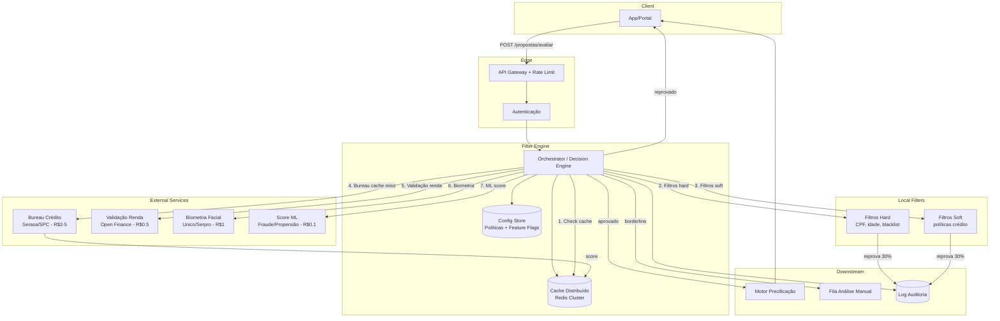

# Componente de Filtro e Redirecionamento para Concessão de Crédito em Alta Escala

**Nível:** avançado
**Tema(s):** rule engine, filtros em cascata, circuit breaker, cache distribuído, otimização de custos, avaliação de risco
**Resumo do problema:**
Uma fintech de crédito pessoal precisa avaliar **centenas de milhares de propostas/dia** através de múltiplos steps (bureau de crédito, score, políticas internas, ML models). Cada consulta externa tem **custo significativo** (R$ 0,50 a R$ 5,00). O componente de filtro deve **eliminar propostas inelegíveis** com **regras hard** (idade, CPF válido, blacklist) e **soft** (score mínimo, faixa de renda, apetite de risco) **antes** de acionar APIs caras. O sistema deve ser **extremamente rápido** (p95 < 100 ms para filtros locais, p95 < 500 ms com consultas externas) e **reduzir drasticamente custos** eliminando 60-80% das propostas em filtros baratos.

## Requisitos Funcionais
- **Avaliação em cascata** (decisão early-return): executar steps do mais barato ao mais caro; interromper no primeiro filtro reprovado **ou aprovado**.
- **Filtros hard-no** (bloqueio definitivo): CPF inválido, idade < 18 ou > 75, blacklist interna, inadimplência ativa, fraude conhecida.
- **Filtros hard-yes** (aprovação automática/fast-track): whitelist VIP (clientes premium), funcionários, parceiros estratégicos, score histórico excelente (≥ 850).
- **Filtros soft** (políticas de crédito): faixa de renda mínima, score bureau ≥ threshold configurável, exposição total do cliente, apetite de risco por produto.
- **Consultas externas**: bureau de crédito (Serasa/SPC), validação de renda (Open Finance/eSocial), biometria facial, score ML (fraude/propensão a pagar).
- **Roteamento inteligente**: direcionar propostas aprovadas para **motores de precificação** (taxa/limite) e **análise manual** (casos borderline).
- **Cache agressivo**: CPF blacklist/whitelist, score bureau recente (TTL 24h), políticas de crédito (TTL 5 min), feature flags de produtos.
- **Configuração dinâmica**: atualizar políticas (thresholds, pesos) e feature toggles **sem redeploy**; A/B testing de regras.
- APIs:
  - `POST /propostas/avaliar` → `{ decisao: "APROVADO|REPROVADO|ANALISE_MANUAL", motivo, scoreDetalhes, custoTotal, fastTrack }`
  - `GET /politicas` (admin: consultar/atualizar políticas de crédito)
  - `POST /blacklist/{cpf}` (admin: adicionar à blacklist)
  - `POST /whitelist/{cpf}` (admin: adicionar clientes VIP/preferencial)
  - `DELETE /whitelist/{cpf}` (admin: remover da lista preferencial)

## Requisitos Não Funcionais
- **Latência**: p95 < 10ms (whitelist VIP), < 50ms (hard-no), < 100ms (soft), < 500ms (1-2 ext), < 1.5s (ML+bio)
- **Throughput**: 5k propostas/s em pico
- **Disponibilidade**: 99,95% (circuit breakers, fallbacks, degradação graciosa)
- **Otimização de Custos**: VIP sem custo externo, eliminar 70%+ em filtros gratuitos, reduzir 50% bureau via cache 24h
- **Consistência**: snapshot de políticas no instante da avaliação (versionamento)
- **Observabilidade**: métricas por step (latência, custo), trace por `propostaId`, alertas desvio >20%
- **Segurança**: PII criptografada, auditoria LGPD/BACEN, rate limit

## Diagrama Conceitual (Mermaid)


## Trade-offs Principais (Discussão em Aula)

| Decisão | Opção A | Opção B | Impacto | Recomendação |
|---------|---------|---------|---------|--------------|
| **Whitelist VIP (hard-yes)** | Fast-track total (5ms, R$ 0) | Validações mínimas (50ms, R$ 0,50) | UX premium vs risco de fraude | Fast-track com limite conservador |
| **TTL cache bureau** | 24h (economia 80%) | 1h (dados frescos) | Economia R$ 15M/mês vs risco score desatualizado | 24h com flag "stale" se > 7 dias |
| **Fallback bureau down** | Reprovar tudo (conservador) | Análise manual (flexível) | Segurança vs experiência do cliente | Manual se cache < 7d, senão reprovar |
| **Steps síncronos vs assíncronos** | Síncrono (UX previsível) | Assíncrono (callback/webhook) | Latência garantida vs throughput 3x maior | Síncrono para fluxo crítico |
| **Batch de consultas** | Individual 1:1 (50ms p95) | Lote 50:1 (500ms p95) | Latência vs economia 30% custo | Individual (priorizar UX) |
| **Orquestração vs Coreografia** | Orquestrador central (visibilidade) | Event-driven (desacoplado) | Fácil debug vs escalabilidade | Orquestrador (rastreabilidade) |

## Cálculo de ROI (1M propostas/dia)

| Cenário | Consultas Bureau | Custo/dia | Economia |
|---------|------------------|-----------|----------|
| Sem otimização | 1.000.000 | R$ 3.500.000 | - |
| Com filtros (70% eliminadas) | 300.000 | R$ 1.050.000 | R$ 2.450.000/dia |
| + Cache 24h (50% hit) | 150.000 | R$ 525.000 | R$ 2.975.000/dia |

**ROI mensal**: R$ 89.250.000 economizados
**Custo infra**: R$ 55.000/mês (Redis + servers + observabilidade)
**ROI líquido**: R$ 89.195.000/mês
**Payback**: ~17 horas

**Métricas de sucesso**: Taxa eliminação ≥70%, Cache hit ≥50%, Custo médio ≤R$1,50/proposta

## Detalhes e Pistas de Implementação

### 1. Arquitetura de Filtros em Cascata
- **Pipeline de Steps**: cada step retorna `APROVADO`, `REPROVADO` ou `CONTINUAR`.
- **Early Return**: interromper ao primeiro `REPROVADO` (fail-fast) **ou** `APROVADO` (fast-track), acumulando motivo.
- **Ordem de execução** (do mais barato ao mais caro, com early exits):
  1. **Validação de CPF** (regex/dígito verificador) — gratuito, < 1 ms
  2. **Whitelist VIP** (cache lookup) — gratuito, < 5 ms → **APROVADO** (pula todos os steps seguintes!)
  3. **Blacklist** (cache lookup) — gratuito, < 5 ms → **REPROVADO** (fail-fast)
  4. **Idade válida** (18-75) — gratuito, < 1 ms → **REPROVADO** se inválido
  5. **Políticas soft** (renda mínima, produto ativo) — cache de políticas, < 10 ms
  6. **Score bureau** (cache 24h ou consulta R$ 2-5) — 50-200 ms
  7. **Validação de renda** Open Finance (R$ 0,50) — 100-300 ms
  8. **Biometria facial** (R$ 1) — 200-500 ms
  9. **Score ML** (R$ 0,10) — 50-100 ms

### 2. Cache Distribuído (Redis)
- **Whitelist/Blacklist**: `SET whitelist:{cpf} {tier} EX -1` (persistente)
- **Score bureau**: `SET bureau:{cpf} {score} EX 86400` (24h TTL, economia 80%)
- **Políticas**: `GET policies:v{version}` (TTL 5min, pub/sub invalidation)
- **Contadores**: `INCR stats:{hora}:{filtro}` para métricas tempo real

### 3. Circuit Breaker e Fallbacks
- Bureau down → cache (< 7d) ou reprovar
- Biometria timeout → análise manual
- ML down → modelo baseline
- Degradação graciosa via feature flags

### 4. Auditoria
- Snapshot: `decisoes(propostaId, versaoPolitica, steps[], timestamp)`
- Replay para auditorias BACEN/LGPD
- Hash SHA-256 para integridade

## Exemplos de Resposta

**Cliente VIP (fast-track - 5ms, R$ 0)**:
```json
{
  "decisao": "APROVADO",
  "fastTrack": true,
  "steps": [
    {"nome": "validacao_cpf", "resultado": "OK", "latencia_ms": 1, "custo": 0},
    {"nome": "whitelist_vip", "resultado": "APROVADO_FAST_TRACK", "latencia_ms": 4, "custo": 0}
  ],
  "custoTotal": 0,
  "tempoTotal_ms": 5
}
```

**Fluxo normal aprovado (255ms, R$ 3,60)**:
```json
{
  "decisao": "APROVADO",
  "steps": [
    {"nome": "validacao_cpf", "latencia_ms": 1, "custo": 0},
    {"nome": "whitelist_vip", "resultado": "NAO_ENCONTRADO", "latencia_ms": 3, "custo": 0},
    {"nome": "blacklist", "latencia_ms": 3, "custo": 0},
    {"nome": "bureau_credito", "score": 720, "latencia_ms": 180, "custo": 3.5},
    {"nome": "ml_fraude", "score": 0.05, "latencia_ms": 60, "custo": 0.1}
  ],
  "custoTotal": 3.6,
  "tempoTotal_ms": 255
}
```

**Reprovado (185ms, R$ 3,50)**:
```json
{
  "decisao": "REPROVADO",
  "motivo": "score_abaixo_minimo",
  "steps": [
    {"nome": "validacao_cpf", "resultado": "OK"},
    {"nome": "bureau_credito", "resultado": "REPROVADO", "score": 580}
  ],
  "custoTotal": 3.5,
  "tempoTotal_ms": 185
}
```

## Perguntas de Reflexão

**Otimização:**
- Como reordenar steps dinamicamente baseado em custos/latências medidos?
- Whitelist VIP: critérios de entrada? Score ≥ 850? LTV? Risco de aprovar sem validações?
- Particionamento do cache para evitar hotspots em CPFs populares?

**Experimentação:**
- Implementar shadow mode para testar políticas sem impactar decisão?
- Rollback de política problemática em < 1 min?

**Compliance:**
- Explicabilidade da decisão (LGPD Art. 20) sem revelar lógica de risco?
- Detectar gaming (fraudador testando milhares de variações de CPF)?

**Escalabilidade:**
- Se throughput dobrar (10k/s), onde está o gargalo: cache, bureau ou orquestrador?
- ML online: retreinar modelo com feedback de fraudes sem afetar latência?
